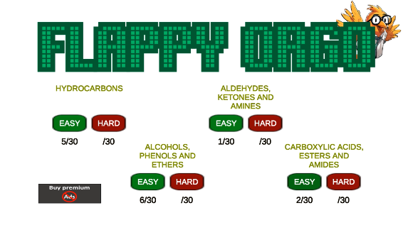
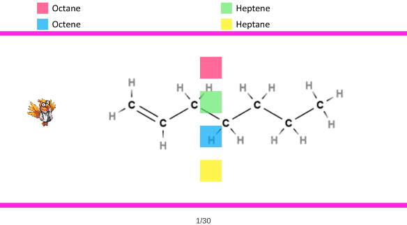
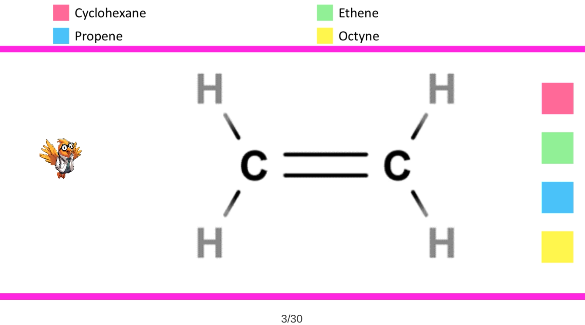
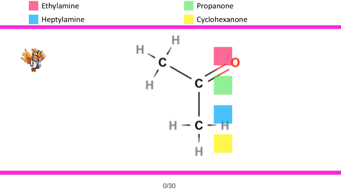

Flappy Orgo is an engaging educational game designed to make learning organic chemistry fun and interactive. This game helps students master the names and structures of organic compounds, which are essential for success in various scientific fields.

## Features

- Four Categories:
  * Hydrocarbons
  * Alcohols, Phenols, and Ethers
  * Aldehydes, Ketones, and Amines
  * Carboxylic Acids, Esters, and Amides
- Difficulty Levels: Each category includes two difficulty levels, providing a total of eight challenges with 30 unique compounds per level.
- Interactive Gameplay: Players navigate obstacles while answering multiple-choice questions, enhancing learning and retention.
- Progress Tracking: Easily monitor your progress and improvement throughout the game.
- Behaviorist Learning Theory: The game is based on behaviorist principles, emphasizing repetition and feedback for effective learning.

## Development

Flappy Orgo was developed by a master's degree holder in educational technology with extensive experience in teaching chemistry. The game combines educational content with engaging gameplay to provide a unique learning experience.

## Also available for Android devices

## Screenshots

